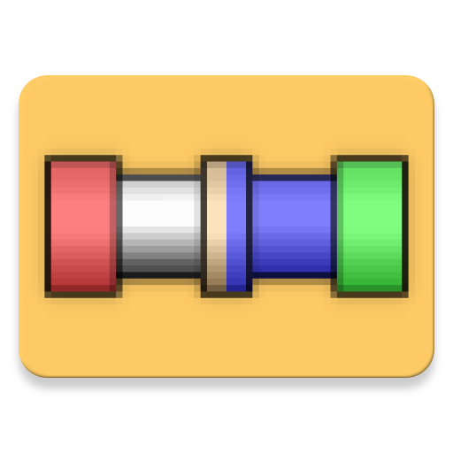

pipepanic-android
===================
A plumbers favorite game!

   

    
PipePanic is about connecting pipes in a hurry before any water spills!

This is an android port of the [PipePanic](http://www.users.waitrose.com/~thunor/jspp/index.html)
game made by Thunor based on [2048-android](https://github.com/uberspot/2048-android) by uberspot.
It gives you a launcher icon and allows offline play. You can get the the game
at [fdroid](https://f-droid.org/en/packages/org.olgsoft.apipepanic/)!
[Or you can try it in your browser!](https://htmlpreview.github.io/?https://github.com/rnauber/pipepanic-android/blob/master/assets/jspp/index.html)

Contributions are very welcome!

Yours,
[rnauber](https://github.com/rnauber)

## How to Play PipePanic

Join the green start-pipe and red end-pipe together using the pieces given to you via the preview
bar on the left. The pipe shown in the rightmost square is the next available pipe for placement
upon the game board. Once the timer reaches zero or you click on 'Fill Pipes' or the green
start-pipe, the game board is cleared of any non-connecting 'dead' pieces and the system is flooded
with liquid. If any leaks are found the liquid stops flowing, so to achieve the highest score you
must cover as much of the game board as possible with a properly connected leakless pipe network.

## Difficulty

    "Who buys cheap, buys twice." (old German proverb)

Sometimes you are forced to use subpar materials for your plumbing job. In the difficulty settings "
medium" to "very hard" you have to use pipes with an increasing likelihood of breakage. So replace
the broken pipes and claim extra money from the manufacturer when they are flooded.

## Scoring

<ul>
    <li>10 points for placing a pipe upon the game board.
    </li>
    <li>-10 points for placing a piece on top of an already existing
        pipe.
    </li>
    <li>5 points for each second left on the timer if you fill the
        system early.
    </li>
    <li>-10 points for each dead pipe left on the board once the system
        starts to flood.
    </li>
    <li>50 points for each successfully flooded pipe.
    </li>
    <li>Additionally 100 points for each broken pipe that you fixed before it is flooded.
    </li>
    <li>250 points for successfully flooding the endpipe (red).
    </li>
</ul>

## Strategies

The pipe pieces given to you on the preview bar are random, but are randomly selected from a
suitable selection, so that if you require a certain piece to complete your network it won't be too
long before it becomes available for use. There are many more vertical and horizontal pipes than the
others.

The best approach is to place out the pieces given to you into a suitable design that will
accommodate future pipes that have yet to appear on the preview bar, rather than simply attempting
to connect one pipe to the next. The less pipes you waste through overwriting the higher your score
will be.

## Battle Mode

If you feel competitive, you can battle with others in "BATTLE MODE"!
Simply choose the same battle number (seed) and then you will get the exact same sequence of pipes.
So no one can blame a low score on just bad luck :)

## Licenses

pipepanic-android is licensed under
the [MIT license.](https://github.com/rnauber/pipepanic-android/blob/master/LICENSE)
The javascript game files are licensed under GPL v2.

